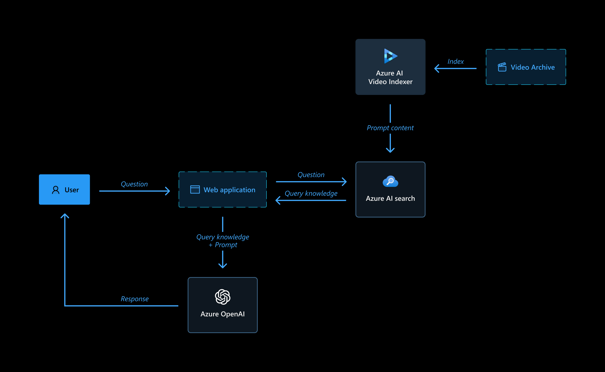
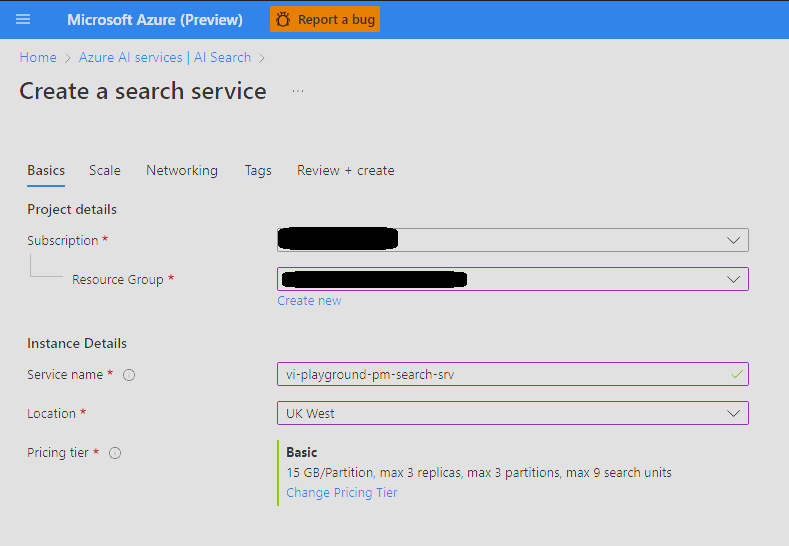
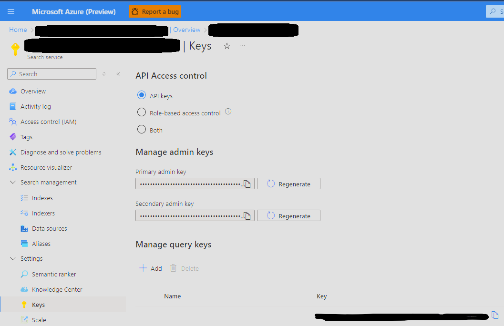

# VideoQnA-LTW: Video Archive Q&A with RAG

**A production-ready Video Archive Q&A application using Retrieval Augmented Generation (RAG)** that integrates Azure AI Video Indexer, Azure OpenAI, and vector databases for intelligent video content analysis and querying.

## ✨ Key Features

- **🎥 Video Intelligence**: Automated video processing with Azure Video Indexer
- **🤖 AI-Powered Q&A**: Natural language queries with contextual video responses  
- **⚡ Smart Caching**: File hash-based duplicate detection system
- **📊 Task Management**: Background processing with real-time progress tracking
- **🔍 Multi-Database Support**: Azure AI Search and ChromaDB vector databases
- **🎯 Template System**: Customizable AI response templates for different use cases
- **📱 Modern UI**: React frontend with Fluent UI components



## 🏗️ Architecture Overview

### Backend (Python/Flask)
- **vi_search/**: Core RAG functionality with video processing pipeline
- **task_manager.py**: Asynchronous task processing with retry logic
- **database/**: SQLite managers for app data, settings, and AI templates  
- **services/**: Business logic layer for templates and settings
- **file_hash_cache.py**: Duplicate detection system (NEW ✨)

### Frontend (React/TypeScript)
- **Fluent UI Components**: Modern, accessible user interface
- **Real-time Updates**: Task progress tracking and status notifications
- **Video Player Integration**: Jump directly to relevant timestamps
- **Library Management**: Upload, organize, and manage video collections

## 🚀 Quick Start

### Option 1: Full Setup with Azure Services
For production deployment with Azure OpenAI and Azure AI Search.

### Option 2: Local Development Setup  
For development and testing without Azure costs.

```powershell
# Clone and navigate to project
git clone <repository-url>
cd VideoQnA-LTW

# Quick start - sets up everything automatically
.\start_local.ps1
```

This script will:
- Create Python virtual environment
- Install all dependencies  
- Build React frontend
- Start Flask backend server
- Open browser to http://localhost:5000

## ⚠️ Important Requirements

**Azure Services** (for production):
- **Azure OpenAI** access enabled ([request here](https://aka.ms/oaiapply))
- **Azure AI Search** service 
- **Azure Video Indexer** account
- Account with `Microsoft.Authorization/roleAssignments/write` permissions

**Cost Notice**: Azure resources have monthly costs - use local development mode for testing.

## 📋 Prerequisites

### Required
- **Python 3.10+** ([Download](https://www.python.org/downloads/))
- **Node.js 18+** ([Download](https://nodejs.org/))  
- **PowerShell 7+** ([Install](https://www.microsoft.com/store/productId/9MZ1SNWT0N5D))
- **Git** ([Download](https://git-scm.com/downloads))

### For Azure Deployment (Optional)
- **Azure Developer CLI** (`winget install Microsoft.Azd`)
- **Azure CLI** (`winget install Microsoft.AzureCLI`)

### Installation Verification
```powershell
# Verify all prerequisites
python --version    # Should show 3.10+
node --version      # Should show 18+
pwsh --version      # Should show 7+
git --version       # Any recent version
```

## 🛠️ Development Modes

### Test Mode (No Azure Required)
Perfect for development and testing without any costs:

```powershell
# Set environment variables for test mode
$env:LANGUAGE_MODEL = "dummy"
$env:PROMPT_CONTENT_DB = "chromadb" 

# Start the application  
.\start_local.ps1
```

**Test Mode Features:**
- ✅ All UI components work
- ✅ Upload and library management  
- ✅ Mock AI responses for testing
- ✅ Local ChromaDB vector storage
- ❌ No real Azure Video Indexer processing
- ❌ No real AI-powered answers

### Production Mode (Azure Required)
Full functionality with Azure services:

```powershell
# Set environment variables for production
$env:LANGUAGE_MODEL = "openai"
$env:PROMPT_CONTENT_DB = "azure_search"

# Configure Azure credentials (see setup section below)
# Start the application
.\start_local.ps1
```

## 🏗️ Production Azure Setup

1. **Create resources**

   Create a resource group to contain all the resources below.

1. **Set up Azure AI Search**

   1. Change pricing tier to Basic.

      

   1. Enter the newly created resource, and note the API key under Settings > Keys, to be used later in the process. You will use the admin key for write permissions to create new indexes.

      

1. **Set up Azure OpenAI**

   1. Create Azure OpenAI instance.
   1. Create model deployments:
      1. text-embedding-ada-002 for embeddings
      1. gpt3.5 turbo or gpt4 turbo or gpt-4o as the LLM model.
   1. Note the deployment names to be used later in the process.
   1. Note API key under Resource management -> Keys and Endpoint to be used later in the process.

1. **Index video archive**

   1. Index videos in VI account.
   1. Make all videos public access.
   1. Define the following azd parameters using `azd env set <Config Key> <Config Value>`:

      - AZURE_OPENAI_API_KEY (Azure OpenAI API key)
      - AZURE_OPENAI_CHATGPT_DEPLOYMENT (Azure OpenAI Chat LLM deployment name}
      - AZURE_OPENAI_EMBEDDINGS_DEPLOYMENT {Azure OpenAI embeddings model deployment name)
      - AZURE_OPENAI_RESOURCE_GROUP (Resource Group name of the Azure OpenAI resource)
      - AZURE_OPENAI_SERVICE (Azure OpenAI resource name)

      - AZURE_SEARCH_KEY (Azure AI Search API key)
      - AZURE_SEARCH_SERVICE (Azure AI Search resource name)
      - AZURE_SEARCH_LOCATION (Azure AI Search instance location, e.g. ukwest)
      - AZURE_SEARCH_SERVICE_RESOURCE_GROUP (Resource Group name of the Azure AI Search resource)
      - AZURE_TENANT_ID (Azure Tenant ID)

      - LANGUAGE_MODEL ("openai")
      - PROMPT_CONTENT_DB (Either: "azure_search" / "chromadb")
      - PROMPT_CONTENT_DB_NAME (Some DB name with this format "vi-db-name-index", this will later appear in the Demo UI under the developer settings so user can select which archive to query)

   1. Index the archive into a new Azure AI Search index (Vector DB) by following these steps:

   1. Install python dependencies with:

      - For Unix/Linux/Mac:

      ```bash
      pip install -r ./app/backend/requirements.txt
      ```

      - For Windows (PowerShell):

      ```powershell
      pip install -r .\app\backend\requirements.txt
      ```

   1. Create a `.env` file that holds your Azure AI Video Indexer details (taken from Azure portal) in the following format:

      ```
      AccountName='YOUR_VI_ACCOUNT_NAME' # This is the name of your Azure AI Video Indexer account.
      ResourceGroup='RESOURCE_GROUP_NAME' # This is the name of the resource group where your Azure AI Video Indexer account is located.
      SubscriptionId='SUBSCRIPTION_ID' # This is the ID of your Azure subscription.
      ```

   1. Save and run the following commands in PowerShell from the workspace root directory:

      - For Unix/Linux/Mac:

      ```bash
      cd ./app/backend/
      export PYTHONPATH=$PYTHONPATH:`pwd` # (to add the current directory to the Python path)
      cd ../../
      python ./app/backend/vi_search/prepare_db.py # (to run the indexing into vector db script)
      ```

      - For Windows (PowerShell):

      ```powershell
      cd .\app\backend\
      $env:PYTHONPATH += ";$(Get-Location)" # (to add the current directory to the Python path)
      cd ..\..\
      python .\app\backend\vi_search\prepare_db.py # (to run the indexing into vector db script)
      ```

      The script will upload the videos in the `data` folder to Azure AI Video Indexer and then index the archive into Azure AI Search or Chroma DB.

   1. Wait for the Vector DB indexing to finish. The process can take some time, as it calls Azure OpenAI to create embeddings of the entire archive, and persists it to Azure AI Search or Chroma DB in batches of 100.
   1. If you are using Chroma DB, which is now configured to save the DB locally, make sure it will be available to the deployment as well.

1. **Deploy**
   1. Install and use PowerShell from https://www.microsoft.com/store/productId/9MZ1SNWT0N5D?ocid=pdpshare
   1. Run `azd up` command to setup the app service resources.
   1. Select subscription and location where to create the app service deployment.
   1. Run `azd deploy` command to deploy the app service and any further changes in the python app service code.

## FAQ

**_Question_**: Why do we need to break up the video `insights.json` into chunks using the Prompt Content API?

**_Answer_**: The sections retrieved from the Video Indexer Prompt Content API allow for the creation of granular records in the vector database. Each of these sections corresponds to a small part of the video. Once the section embedding is generated and subsequently retrieved, the user is shown the relevant time segment in the video.

## Troubleshooting

#### Error during deployment

If you see this error while running `azd deploy`:

`read /tmp/azd1992237260/backend_env/lib64: is a directory`

delete the `./app/backend/backend_env folder` and re-run the `azd deploy` command.

This issue is being tracked here: https://github.com/Azure/azure-dev/issues/1237

If the web app fails to deploy and you receive a '404 Not Found' message in your browser, run 'azd deploy'.

#### Video Indexing Process Timed Out

If the video indexing process timeout is reached, don't worry. You can simply execute the `prepare_db.py` script again. The script is designed to continue where it left off, so you won't lose any progress made before the timeout occurred.

#### Executing prepare_db.py results in a type error

Make sure you have the correct version of Python installed. The script requires Python 3.10. You can check your Python version by running `python --version` in your terminal.
