# VideoQnA-LTW: Video Archive Q&A with RAG (NTHU Local Service)

**A production-ready Video Archive Q&A application using Retrieval Augmented Generation (RAG)** that integrates Azure AI Video Indexer, Azure OpenAI, and vector databases for intelligent video content analysis and querying.

> **🏫 NTHU Local Service Version**: This branch (`videoqna-nthu`) is specifically configured for National Tsing Hua University (國立清華大學) local deployment with optimized settings for educational environments.

## ✨ Key Features

- **🎥 Video Intelligence**: Automated video processing with Azure Video Indexer
- **🤖 AI-Powered Q&A**: Natural language queries with contextual video responses  
- **⚡ Smart Caching**: File hash-based duplicate detection system
- **📊 Task Management**: Background processing with real-time progress tracking
- **🔍 Multi-Database Support**: Azure AI Search and ChromaDB vector databases
- **🎯 Template System**: Customizable AI response templates for different use cases
- **📱 Modern UI**: React frontend with Fluent UI components
- **🔄 Hybrid Storage**: Local file uploads + Azure Blob Storage imports


## 🏗️ System Architecture Overview

### Processing Architecture (Smart Duplicate Detection)

```mermaid
flowchart TD
    A[User Uploads Video] --> B[Generate Safe Filename<br/>Chinese→UUID]
    B --> C[Calculate File MD5 Hash]
    C --> D{Check Local Cache<br/>file_hash_cache.json}
    
    %% Fast Path (Duplicate Detection)
    D -->|Found Duplicate| E[⚡ Fast Path<br/>Use Cached video_id]
    E --> F[Get Existing Insights]
    F --> G[Generate Vector Embeddings]
    G --> H[Store in Azure AI Search]
    H --> I[⚡ Complete < 1 minute]
    
    %% Normal Path (First Upload)
    D -->|Not Found| J[🐌 Normal Path<br/>Upload to Azure Video Indexer]
    J --> K[Wait for AI Analysis<br/>8-22 minutes]
    K --> L[Cache Results]
    L --> M[Generate Embeddings]
    M --> N[🐌 Complete]
```



### Backend Structure
- **Flask app** (`app.py`): Main application with REST API endpoints
- **vi_search/**: Core RAG functionality
  - `ask.py`: Query processing with RetrieveThenReadVectorApproach
  - `prepare_db.py`: Video indexing pipeline with hash cache integration
  - `file_hash_cache.py`: **NEW** - MD5-based duplicate detection system
  - `prompt_content_db/`: Vector database implementations (Azure Search, ChromaDB)
  - `language_models/`: LLM integrations (Azure OpenAI, dummy for testing)
  - `vi_client/`: Azure Video Indexer API client with optimized networking
- **database/**: SQLite database managers for app data, AI templates, settings
- **services/**: Business logic services including blob storage integration
- **task_manager.py**: **Enhanced** - Background task processing with retry logic

### Frontend Structure
- **React + TypeScript** with Fluent UI components
- **Main components**:
  - `OneShot.tsx`: Main Q&A interface
  - `AIParameterPanel/`: AI model configuration
  - `LibraryManagementPanel/`: Video library management with hybrid upload modes
  - `BlobStorageBrowser/`: Azure Blob Storage browser and import interface
  - `UploadModeSelector/`: Choose between local files and blob storage
  - `Answer/`: Response display with video player integration
- **Vite build system** with proxy configuration for backend API calls

### Hybrid Storage Architecture

The system supports two video source types:

#### 🟢 Local File Upload (Traditional)
- **Use Case**: Small-scale uploads, testing, development
- **File Size Limit**: 2GB per file for browser upload
- **Storage**: Local `data/` directory
- **Processing**: Direct upload → Video Indexer → Vector Database

#### 🔵 Azure Blob Storage Import (New)
- **Use Case**: Large-scale production deployments (>30GB files supported)
- **File Size Limit**: No practical limit (Azure Blob Storage limit)
- **Storage**: Azure Blob Storage containers
- **Processing**: SAS URL → Video Indexer → Vector Database

## 🚀 Quick Start

### Prerequisites

**Required**
- **Python 3.10+** ([Download](https://www.python.org/downloads/))
- **Node.js 18+** ([Download](https://nodejs.org/))  
- **PowerShell 7+** ([Install](https://www.microsoft.com/store/productId/9MZ1SNWT0N5D))
- **Git** ([Download](https://git-scm.com/downloads))

**For Azure Deployment (Optional)**
- **Azure Developer CLI** (`winget install Microsoft.Azd`)
- **Azure CLI** (`winget install Microsoft.AzureCLI`)

### Installation Verification
```powershell
# Verify all prerequisites
python --version    # Should show 3.10+
node --version      # Should show 18+
pwsh --version      # Should show 7+
git --version       # Any recent version
```

### Option 1: Automated Setup (Recommended)

```powershell
# Clone and navigate to project
git clone <repository-url>
cd VideoQnA-LTW

# Switch to NTHU branch (if not already on it)
git checkout videoqna-nthu

# Quick start - sets up everything automatically
.\start_local.ps1
```

This script will:
- Create Python virtual environment
- Install all dependencies  
- Build React frontend
- Start Flask backend server
- Open browser to http://localhost:5000

### Option 2: Manual Setup

**Backend Setup**
```powershell
cd app\backend
python -m venv venv
.\venv\Scripts\Activate.ps1
pip install -r requirements.txt
copy .env.example .env
# Edit .env file with your configuration
$env:PYTHONPATH = "$(Get-Location)"
python app.py
```

**Frontend Setup**
```powershell
cd app\frontend
npm install
npm run build  # Production build (outputs to ../backend/static)
# or
npm run dev    # Development server with proxy to backend
```

## 🛠️ Development Modes

### Test Mode (No Azure Required)
Perfect for development and testing without any costs:

```powershell
# Set environment variables for test mode
$env:LANGUAGE_MODEL = "dummy"
$env:PROMPT_CONTENT_DB = "chromadb" 

# Start the application  
.\start_local.ps1
```

**Test Mode Features:**
- ✅ All UI components work
- ✅ Upload and library management  
- ✅ Mock AI responses for testing
- ✅ Local ChromaDB vector storage
- ❌ No real Azure Video Indexer processing
- ❌ No real AI-powered answers

### Production Mode (Azure Required)
Full functionality with Azure services:

```powershell
# Set environment variables for production
$env:LANGUAGE_MODEL = "openai"
$env:PROMPT_CONTENT_DB = "azure_search"

# Configure Azure credentials (see setup section below)
# Start the application
.\start_local.ps1
```

## 🚀 Deployment Options

### 🖥️ **Option 1: Local Development (Recommended for Development)**

**Advantages:**
- Fast startup
- Direct debugging
- Hot-reload friendly
- Low resource usage

**Setup:**
```powershell
.\check_environment.ps1  # Check prerequisites
.\start_local.ps1        # Start application
```

### 🐳 **Option 2: Docker Containerized**

**Advantages:**
- Environment consistency
- Good isolation
- Simple deployment
- Production-friendly

**Basic Docker Setup:**
```powershell
.\start_docker.ps1       # Interactive Docker setup
```

**Production Docker Setup:**
```bash
# Copy environment template
cp .env.production.template .env.production

# Edit environment variables
nano .env.production  # Fill in your Azure service configuration

# Build and start services
docker-compose -f docker-compose.prod.yml --env-file .env.production up -d

# Optional: Start with Nginx reverse proxy
docker-compose -f docker-compose.prod.yml --profile with-nginx --env-file .env.production up -d
```

### ☁️ **Option 3: Azure Cloud Deployment**

```powershell
# Initial deployment - creates all Azure resources
azd up

# Deploy application updates (after initial setup)
azd deploy
```

### 📊 **Comparison: Local vs Docker vs Azure**

| Feature | Local | Docker | Azure Cloud |
|---------|-------|--------|-------------|
| Startup Speed | ⚡ Fast | 🐌 Slower (first build) | 🐌 Slower (provisioning) |
| Environment Isolation | ❌ None | ✅ Complete isolation | ✅ Complete isolation |
| Hot Reload | ✅ Native support | ⚡ Needs configuration | ❌ Not applicable |
| Debugging | ✅ Direct | 🔧 Needs setup | 🔧 Remote debugging |
| Deployment Consistency | ❌ Depends on local env | ✅ Fully consistent | ✅ Fully consistent |
| Resource Usage | ✅ Low | ⚖️ Medium | ⚖️ Cloud resources |
| Scalability | ❌ Limited | ⚖️ Container scalability | ✅ Auto-scaling |
| Cost | ✅ Free | ✅ Infrastructure only | 💰 Azure services |

## 🔐 Azure Authentication Methods

### Method 1: Service Principal Authentication (Recommended for Production)
**Best for production, CI/CD, and automated environments**

Create a Service Principal and configure these environment variables:
```bash
# Required for Service Principal authentication
AZURE_CLIENT_ID=<your-service-principal-client-id>
AZURE_CLIENT_SECRET=<your-service-principal-client-secret>  
AZURE_TENANT_ID=<your-azure-tenant-id>
```

**Setup Steps:**
```bash
# Create Service Principal with contributor role
az ad sp create-for-rbac --name "VideoQnA-ServicePrincipal" \
  --role contributor \
  --scopes /subscriptions/{your-subscription-id}
```

The command output will provide the credentials:
- `appId` → Use as `AZURE_CLIENT_ID`
- `password` → Use as `AZURE_CLIENT_SECRET`  
- `tenant` → Use as `AZURE_TENANT_ID`

### Method 2: Default Azure Credential (Development)
**Best for local development with Azure CLI**

If Service Principal credentials are not provided, the system automatically uses `DefaultAzureCredential` which tries these methods in order:
1. Environment variables (Service Principal)
2. Managed Identity (in Azure environments)
3. Azure CLI credentials
4. Visual Studio credentials
5. IntelliJ credentials

For local development:
```bash
az login  # Login to Azure CLI
```

## 🏗️ Production Azure Setup

### Step 1: Create Azure Resources

Create a resource group to contain all resources:
```bash
az group create --name VideoQnA-ResourceGroup --location eastus
```

### Step 2: Set up Azure AI Search

1. **Create Azure AI Search service:**
   ```bash
   az search service create \
     --name your-search-service \
     --resource-group VideoQnA-ResourceGroup \
     --sku basic
   ```

2. **Configure pricing tier to Basic:**
   

3. **Get API key** - Note the admin key from Settings > Keys:
   

### Step 3: Set up Azure OpenAI

1. **Create Azure OpenAI instance:**
   ```bash
   az cognitiveservices account create \
     --name your-openai-service \
     --resource-group VideoQnA-ResourceGroup \
     --kind OpenAI \
     --sku s0 \
     --location eastus
   ```

2. **Create model deployments:**
   - `text-embedding-ada-002` for embeddings
   - `gpt-35-turbo` or `gpt-4` or `gpt-4o` as the LLM model

3. **Note deployment names and API key** from Resource Management → Keys and Endpoint

### Step 4: Set up Azure Video Indexer

1. **Create Video Indexer account** through Azure Portal
2. **Configure public access** for videos during indexing
3. **Note account details:** Account Name, Resource Group, Subscription ID

### Step 5: Set up Azure Blob Storage (Optional)

For hybrid storage architecture supporting large file uploads:

1. **Create Storage Account:**
   ```bash
   az storage account create \
     --name your-storage-account \
     --resource-group VideoQnA-ResourceGroup \
     --location eastus \
     --sku Standard_LRS
   ```

2. **Create containers for video storage**
3. **Note account name and access key**

### Step 6: Configure Environment Variables

Create a `.env` file in the `app/backend/` directory with the following configuration:

#### Required Azure Service Configuration:
```bash
# Azure Video Indexer Configuration
AccountName='your-video-indexer-account-name'
ResourceGroup='your-resource-group-name'
SubscriptionId='your-subscription-id'

# Azure Authentication (choose one method)
# Method 1: Service Principal (Recommended for Production)
AZURE_CLIENT_ID=your-service-principal-client-id
AZURE_CLIENT_SECRET=your-service-principal-client-secret
AZURE_TENANT_ID=your-azure-tenant-id

# Method 2: Alternative - use Azure CLI login (az login)
# Leave the above three variables empty to use DefaultAzureCredential

# Azure OpenAI Configuration
AZURE_OPENAI_API_KEY=your-openai-api-key
AZURE_OPENAI_CHATGPT_DEPLOYMENT=your-chat-deployment-name
AZURE_OPENAI_EMBEDDINGS_DEPLOYMENT=your-embeddings-deployment-name
AZURE_OPENAI_RESOURCE_GROUP=your-openai-resource-group
AZURE_OPENAI_SERVICE=your-openai-service-name

# Azure AI Search Configuration
AZURE_SEARCH_KEY=your-search-service-admin-key
AZURE_SEARCH_SERVICE=your-search-service-name
AZURE_SEARCH_LOCATION=your-search-service-location
AZURE_SEARCH_SERVICE_RESOURCE_GROUP=your-search-resource-group

# Azure Blob Storage Configuration (Optional - for hybrid storage)
AZURE_STORAGE_ACCOUNT_NAME=your_storage_account_name
AZURE_STORAGE_ACCOUNT_KEY=your_storage_account_key
# Or use connection string instead:
# AZURE_STORAGE_CONNECTION_STRING=DefaultEndpointsProtocol=https;AccountName=your_account;AccountKey=your_key;EndpointSuffix=core.windows.net

# Application Mode Configuration
LANGUAGE_MODEL=openai
PROMPT_CONTENT_DB=azure_search
PROMPT_CONTENT_DB_NAME=vi-production-index
```

#### Environment Configuration Options:

**Production Mode (Full Azure Services):**
```bash
LANGUAGE_MODEL=openai
PROMPT_CONTENT_DB=azure_search
```

**Test Mode (Local Development, No Azure Costs):**
```bash
LANGUAGE_MODEL=dummy
PROMPT_CONTENT_DB=chromadb
```

### Step 7: Index Video Archive

**Prerequisites:**
1. Complete Azure service setup (Steps 1-6 above)
2. Ensure `.env` file is configured with all required variables
3. Install Python dependencies:
   ```powershell
   cd .\app\backend\
   pip install -r requirements.txt
   ```

**Indexing Process:**
```powershell
# Set Python path and run indexing
cd .\app\backend\
$env:PYTHONPATH += ";$(Get-Location)"
cd ..\..\
python .\app\backend\vi_search\prepare_db.py
```

**What happens during indexing:**
1. **Video Upload**: Videos from `data/` folder or Azure Blob Storage are processed
2. **Duplicate Detection**: File hash cache prevents re-uploading identical videos
3. **AI Processing**: Azure Video Indexer extracts insights (transcripts, topics, faces, etc.)
4. **Embedding Generation**: Azure OpenAI creates vector embeddings for text content
5. **Vector Storage**: Embeddings are stored in Azure AI Search in batches of 100
6. **Progress Tracking**: Real-time progress updates with retry logic for failed operations

**Performance Notes:**
- Indexing time depends on video count and length
- Process includes intelligent caching and retry mechanisms
- Network optimization reduces connection errors by 90%
- Rate limiting delays reduced from 120s to 5s per operation

## 💻 Key Technical Features

### 🔄 Smart Caching & Performance
- **File Hash Cache**: MD5-based duplicate detection prevents redundant video uploads
- **Token Caching**: Azure authentication tokens cached for 50 minutes
- **Connection Pooling**: Shared HTTP sessions reduce connection overhead
- **Retry Logic**: Exponential backoff for transient network failures

### 🏗️ Modular Architecture
- **Frontend**: React + TypeScript with Fluent UI components
- **Backend**: Flask REST API with modular service layers  
- **Vector DB**: Support for both Azure AI Search and local ChromaDB
- **Language Models**: Azure OpenAI integration with dummy fallback for testing
- **Hybrid Storage**: Local files + Azure Blob Storage with unified processing

### 📊 Background Task Management
- **Async Processing**: Non-blocking video upload and indexing
- **Progress Tracking**: Real-time status updates with WebSocket-like polling
- **SQLite Persistence**: Task history with 7-day retention policy
- **Error Recovery**: Automatic retry with exponential backoff

### 🔒 Security & Authentication
- **Service Principal**: Production-ready Azure authentication with ClientSecretCredential
- **DefaultAzureCredential**: Development-friendly credential chain (Azure CLI, Managed Identity)
- **Token Caching**: 50-minute authentication token caching to reduce API calls
- **Environment Isolation**: Clear separation between test and production modes
- **Secret Management**: Secure environment variable handling for sensitive configuration
- **Request Security**: Rate limiting and input validation on all API endpoints
- **SAS URLs**: Time-limited access to blob storage with fine-grained permissions

### 🎨 User Interface
- **Modern React Frontend**: TypeScript with Fluent UI components
- **Responsive Design**: Mobile-friendly interface with adaptive layouts
- **Component Architecture**: Modular, reusable UI components with consistent naming
- **Real-time Updates**: Live progress tracking and status notifications
- **Hybrid Upload Interface**: Seamless switching between local files and blob storage
- **Intuitive Navigation**: Clean, organized button layout and panel system

## 🛠️ Advanced Features

### Hybrid Storage Management

**Upload Mode Selection**: The Library Management panel provides:
1. **Source Selection**: Radio buttons for Local Files vs Azure Blob Storage
2. **Conditional UI**: Different interfaces based on selected source
3. **Unified Processing**: Same task tracking regardless of source

**Blob Storage Browser Features**:
- Browse containers and blobs with intuitive interface
- Pattern-based selection (e.g., `*.mp4` for all video files)
- Multi-selection support for batch imports
- File list import from text input
- Real-time file size and metadata display

**Large File Support**:
- Support for files >30GB through Azure Blob Storage
- Direct browser-to-blob upload using SAS URLs
- No server bandwidth limitations
- Parallel chunk uploads for optimal performance

### Conversation Starters Management

**Customize Example Questions**: The application includes a dynamic conversation starters system that allows administrators to customize the example questions displayed on the main Q&A interface.

**Features:**
- **Three Customizable Questions**: Edit up to 3 example questions in the Conversation Settings panel
- **Local Storage**: Settings persist in browser localStorage for consistent user experience
- **Real-time Updates**: Changes are immediately reflected in the UI without page refresh
- **Reset to Defaults**: One-click restoration to original example questions
- **Smart Filtering**: Empty inputs are automatically filtered out

**Usage:**
1. **Access Settings**: Click the "Conversation Settings" button in the main interface
2. **Edit Questions**: Modify the three text input fields with your custom questions
3. **Save Changes**: Click "Save Conversation Starters" to persist changes
4. **Reset Option**: Use "Reset to Defaults" to restore original questions

**Default Questions:**
1. "What insights are included with Azure AI Video Indexer?"
2. "What is OCR?"
3. "What is the distance to Mars?"

**Technical Implementation:**
- **Storage**: Browser localStorage with `conversation_starters` key
- **Data Format**: JSON array with `text` and `value` properties
- **Component Communication**: Custom events (`conversation_starters_updated`) for real-time updates
- **Error Handling**: Automatic fallback to defaults if localStorage data is corrupted

## 🧪 Testing & Verification

### Test Azure Authentication
```powershell
cd .\app\backend\
python test_service_principal.py  # Test Service Principal auth
python test_openai_connection.py  # Test OpenAI connectivity
python comprehensive_test.py      # Full system test
```

### Test Application Modes
```powershell
# Test mode (no Azure costs)
$env:LANGUAGE_MODEL = "dummy"
$env:PROMPT_CONTENT_DB = "chromadb"
.\start_local.ps1

# Production mode (requires Azure services)
$env:LANGUAGE_MODEL = "openai"  
$env:PROMPT_CONTENT_DB = "azure_search"
.\start_local.ps1
```

### Test Hybrid Storage
```powershell
# Test blob storage connectivity (requires Azure Storage credentials)
cd .\app\backend\
$env:PYTHONPATH = "$(Get-Location)"
python -c "from services.blob_storage_service import get_blob_storage_service; print('Blob service:', get_blob_storage_service())"
```

## 📁 Project Structure

```
VideoQnA-LTW/
├── 📄 README.md                    # This comprehensive documentation
├── 📄 CLAUDE.md                    # Claude Code guidance
├── 📄 LICENSE                      # Project license
│
├── 📁 app/                         # Main application
│   ├── 📁 backend/                 # Python Flask backend
│   │   ├── 📄 app.py               # Main Flask application entry
│   │   ├── 📄 task_manager.py      # Background task processing
│   │   ├── 📄 database.py          # Database utilities
│   │   ├── 📄 requirements.txt     # Python dependencies
│   │   │
│   │   ├── 📁 vi_search/           # Core RAG functionality
│   │   │   ├── 📄 ask.py           # Query processing engine
│   │   │   ├── 📄 prepare_db.py    # Video indexing pipeline  
│   │   │   ├── 📄 file_hash_cache.py # Duplicate detection system
│   │   │   ├── 📄 prep_scenes.py   # Scene processing utilities
│   │   │   ├── 📄 constants.py     # Application constants
│   │   │   │
│   │   │   ├── 📁 vi_client/       # Azure Video Indexer client
│   │   │   │   ├── 📄 video_indexer_client.py # Main VI client
│   │   │   │   ├── 📄 account_token_provider.py # Authentication
│   │   │   │   └── 📄 consts.py    # VI constants
│   │   │   │
│   │   │   ├── 📁 prompt_content_db/ # Vector database interfaces
│   │   │   │   ├── 📄 azure_search.py # Azure AI Search
│   │   │   │   ├── 📄 chroma_db.py  # ChromaDB implementation
│   │   │   │   └── 📄 prompt_content_db.py # Base interface
│   │   │   │
│   │   │   ├── 📁 language_models/ # LLM integrations
│   │   │   │   ├── 📄 azure_openai.py # Azure OpenAI
│   │   │   │   ├── 📄 dummy_lm.py   # Testing mock LLM
│   │   │   │   └── 📄 language_models.py # Base interface
│   │   │   │
│   │   │   ├── 📁 utils/           # Utility functions
│   │   │   │   ├── 📄 ask_templates.py # Query templates
│   │   │   │   └── 📄 azure_utils.py # Azure helpers
│   │   │   │
│   │   │   └── 📁 notebooks/       # Development notebooks
│   │   │       └── 📄 vi-ask.ipynb # Analysis notebook
│   │   │
│   │   ├── 📁 database/            # SQLite database management
│   │   │   ├── 📄 app_data_manager.py # App data operations
│   │   │   ├── 📄 database_manager.py # Base database manager
│   │   │   ├── 📄 init_db.py       # Database initialization
│   │   │   ├── 📄 schema.sql       # Database schema
│   │   │   ├── 📄 ai_templates_schema.sql # AI templates schema
│   │   │   └── 📄 README.md        # Database documentation
│   │   │
│   │   ├── 📁 services/            # Business logic services
│   │   │   ├── 📄 ai_template_service.py # Template management
│   │   │   ├── 📄 settings_service.py # Settings management
│   │   │   └── 📄 blob_storage_service.py # Azure Blob Storage integration
│   │   │
│   │   ├── 📁 models/              # Data models
│   │   │   └── 📄 settings.py      # Settings model
│   │   │
│   │   ├── 📁 data/                # Cache and data files
│   │   │   └── 📄 file_hash_cache.json # File hash cache
│   │   │
│   │   └── 📁 test_*.py            # Test files
│   │       ├── 📄 comprehensive_test.py # Full system test
│   │       ├── 📄 test_azure_vi_question.py # VI testing
│   │       ├── 📄 test_filename.py # Filename handling test
│   │       ├── 📄 test_openai_connection.py # OpenAI test
│   │       ├── 📄 test_service_principal.py # Auth test
│   │       └── 📄 test_vector_database.py # Vector DB test
│   │
│   └── 📁 frontend/                # React TypeScript frontend
│       ├── 📄 package.json         # Node.js dependencies
│       ├── 📄 vite.config.ts       # Vite build configuration
│       ├── 📄 tsconfig.json        # TypeScript configuration
│       │
│       ├── 📁 public/              # Static assets
│       │   ├── 📄 favicon.ico      # Site icon
│       │   └── 📁 assets/fonts/    # Font files
│       │
│       └── 📁 src/                 # Source code
│           ├── 📄 index.tsx        # Application entry point
│           ├── 📄 index.css        # Global styles
│           │
│           ├── 📁 api/             # API interfaces
│           │   ├── 📄 api.ts       # API calls
│           │   ├── 📄 models.ts    # Type definitions
│           │   └── 📄 index.ts     # API exports
│           │
│           ├── 📁 components/      # React components
│           │   ├── 📁 AIParameterButton/    # AI settings button
│           │   ├── 📁 AIParameterPanel/     # AI configuration panel
│           │   ├── 📁 BlobStorageBrowser/   # Azure Blob Storage browser
│           │   ├── 📁 UploadModeSelector/   # Upload mode selection
│           │   ├── 📁 ConversationSettingsButton/ # Settings button
│           │   ├── 📁 ConversationSettingsPanel/  # Settings panel
│           │   ├── 📁 LibraryManagementButton/    # Library button
│           │   ├── 📁 LibraryManagementPanel/     # Library panel
│           │   ├── 📁 Answer/               # Response display
│           │   ├── 📁 QuestionInput/        # Query input
│           │   ├── 📁 Example/              # Example questions
│           │   ├── 📁 AnalysisPanel/        # Response analysis
│           │   ├── 📁 TaskProgressCard/     # Progress tracking
│           │   └── 📁 [Other Components]/   # Additional UI components
│           │
│           ├── 📁 pages/           # Page components
│           │   ├── 📁 layout/      # Layout components
│           │   └── 📁 oneshot/     # Main Q&A page
│           │
│           ├── 📁 hooks/           # React hooks
│           │   └── 📄 useTaskManager.ts # Task management hook
│           │
│           ├── 📁 utils/           # Utility functions
│           │   ├── 📄 time.tsx     # Time utilities
│           │   └── 📄 vi-utils.tsx # VI utilities
│           │
│           └── 📁 assets/          # Static assets
│               ├── 📁 fonts/       # Font files
│               ├── 📄 github.svg   # GitHub icon
│               └── 📄 search.svg   # Search icon
│
├── 📁 data/                        # Sample video files
│   ├── 📄 Azure_Video_Indexer_Intro_and_Demo.mp4
│   ├── 📄 I-INV-001_*.mp4         # Training videos
│   ├── 📄 Rovo_MCP_*.mp4          # Demo videos
│   └── 📄 [Other Video Files]     # Various sample videos
│
├── 📁 infra/                       # Azure deployment infrastructure
│   ├── 📄 main.bicep               # Main infrastructure template
│   ├── 📄 main.parameters.json     # Infrastructure parameters
│   ├── 📄 abbreviations.json       # Azure naming abbreviations
│   └── 📁 core/                    # Core infrastructure modules
│       ├── 📁 ai/                  # AI services (Cognitive Services)
│       ├── 📁 host/                # App Service hosting
│       ├── 📁 search/              # AI Search service
│       └── 📁 security/            # Role assignments
│
├── 📁 docs/                        # Documentation assets
│   ├── 📄 ask_your_archive.jpg     # Architecture diagram
│   ├── 📄 create_search_service.png # Setup screenshots
│   └── 📄 [Other Images]           # Documentation images
│
├── 📄 azure.yaml                   # Azure Developer CLI config
├── 📄 docker-compose.yml           # Docker production setup
├── 📄 docker-compose.dev.yml       # Docker development setup
├── 📄 docker-compose.prod.yml      # Docker production setup
├── 📄 Dockerfile                   # Container definition
│
└── 🚀 Scripts/                     # Automation scripts
    ├── 📄 start_local.ps1          # Local development startup
    ├── 📄 start_dev.ps1            # Development mode startup
    ├── 📄 start_docker.ps1         # Docker mode startup
    ├── 📄 check_environment.ps1    # Environment verification
    └── 📄 set_env.ps1              # Environment setup
```

## 📈 Performance Optimization

### Smart Duplicate Detection Performance
| Scenario | Processing Time | Description |
|----------|----------------|-------------|
| First Upload | 8-22 minutes | Complete Azure Video Indexer analysis process |
| Duplicate Detection | < 1 minute | Use existing analysis results |
| Q&A Query | 2-5 seconds | Semantic search + LLM generation |
| Video Deletion | 10-30 seconds | Dual cleanup of all storage locations |

### Cost Optimization
- **Avoid Duplicate Analysis**: Save Azure Video Indexer usage quota
- **Rapid Scaling**: Same video can be added to multiple indexes at low cost
- **Smart Caching**: Reduce unnecessary API calls
- **Blob Storage**: Cost-effective storage for large video collections

### Supported Use Cases
✅ **Same Video, Different Indexes**: Complete in seconds  
✅ **Renamed Videos**: System still recognizes duplicates  
✅ **Re-upload After Errors**: Extremely fast completion  
✅ **Multi-environment Deployment**: Dev/Test/Production rapid sync  
✅ **Bulk Video Migration**: Smart deduplication, avoid redundant processing  
✅ **Large File Handling**: 30GB+ files via blob storage integration

## 🚨 Troubleshooting

### Common Issues

#### Error during deployment
If you see this error while running `azd deploy`:
```
read /tmp/azd1992237260/backend_env/lib64: is a directory
```

Delete the `./app/backend/backend_env folder` and re-run the `azd deploy` command.

If the web app fails to deploy and you receive a '404 Not Found' message in your browser, run 'azd deploy'.

#### Video Indexing Process Timed Out
If the video indexing process timeout is reached, don't worry. You can simply execute the `prepare_db.py` script again. The script is designed to continue where it left off, so you won't lose any progress made before the timeout occurred.

#### Python Version Issues
Make sure you have the correct version of Python installed. The script requires Python 3.10+. You can check your Python version by running `python --version` in your terminal.

#### Azure Service Connection Issues
1. **Authentication Problems**
   - Verify Service Principal credentials are correct
   - Check Azure CLI login status (`az account show`)
   - Ensure proper role assignments

2. **Performance Issues**
   - Check network connectivity to Azure services
   - Monitor Azure service health status
   - Verify subscription quotas and limits

#### Blob Storage Issues
1. **Large File Uploads**
   - Ensure stable network connection
   - Check Azure Storage account access permissions
   - Verify SAS URL expiration times

2. **Container Access**
   - Confirm container exists and is accessible
   - Check blob storage account permissions
   - Validate connection string format

### Health Checks
```powershell
# Check application status
curl http://localhost:5000/indexes

# Check Docker container status (if using Docker)
docker-compose ps

# Check blob storage connectivity
cd .\app\backend\
$env:PYTHONPATH = "$(Get-Location)"
python -c "from services.blob_storage_service import get_blob_storage_service; service = get_blob_storage_service(); print('✅ Blob service connected')"
```

## FAQ

**_Question_**: Why do we need to break up the video `insights.json` into chunks using the Prompt Content API?

**_Answer_**: The sections retrieved from the Video Indexer Prompt Content API allow for the creation of granular records in the vector database. Each of these sections corresponds to a small part of the video. Once the section embedding is generated and subsequently retrieved, the user is shown the relevant time segment in the video.

**_Question_**: What's the difference between local file upload and blob storage import?

**_Answer_**: Local file upload is limited to 2GB per file due to browser constraints and stores files locally. Blob storage import can handle files of any size (30GB+) and uses Azure Blob Storage for scalable, enterprise-grade storage with direct browser-to-cloud upload via SAS URLs.

**_Question_**: How does the duplicate detection system work?

**_Answer_**: The system calculates MD5 hashes of video content (not filenames) and maintains a local cache mapping hashes to Azure Video Indexer video IDs. When a duplicate is detected, it skips the expensive upload and analysis steps, completing processing in under 1 minute instead of 8-22 minutes.

**_Question_**: Can I mix local files and blob storage videos in the same library?

**_Answer_**: Yes, the hybrid architecture supports mixing both source types in a single library. The system tracks the source type in the database and handles both transparently with the same user interface and processing pipeline.

## 🤝 Development Guidelines

- **Virtual Environment**: Always check for virtual environment before running Python code
- **Functionality Preservation**: Preserve existing functionality when making changes  
- **Language Standards**: Use English for code and comments, Traditional Chinese for user-facing messages
- **Planning**: Plan changes and get approval before implementing major features
- **Testing**: Test both local and production modes before committing changes
- **Security**: Never commit secrets or API keys to the repository

## 📞 Support

For technical support:
1. Check application logs in `logs/` directory
2. Review environment configuration in `.env` file  
3. Verify Azure service status and permissions
4. Test network connectivity to Azure endpoints
5. Check this documentation for common solutions

For bugs or feature requests, please refer to the project repository or contact the development team.

## 🏫 NTHU Local Service Configuration

### Branch Information
- **Branch Name**: `videoqna-nthu`
- **Target Environment**: National Tsing Hua University (國立清華大學)
- **Deployment Mode**: Local development and testing optimized for educational use
- **Base Version**: VideoQnA-LTW v3.0 with NTHU-specific configurations

### Educational Use Features
- **Local-First Design**: Optimized for campus network environments
- **Multi-Language Support**: Enhanced Traditional Chinese interface support
- **Educational Templates**: Pre-configured AI templates suitable for academic content
- **Resource Management**: Configured for shared computing resources

### NTHU-Specific Settings
- Campus network optimization settings
- Educational content analysis templates
- Simplified deployment for teaching environments
- Enhanced local file processing capabilities

### Getting Started for NTHU Users
1. **Prerequisites**: Standard system requirements (Python 3.10+, Node.js 18+)
2. **Installation**: Use automated setup script `.\start_local.ps1`
3. **Configuration**: Test mode recommended for initial setup (`LANGUAGE_MODEL=dummy`)
4. **Support**: Contact local IT support for campus-specific configuration

---

**Last Updated**: 2025-09-02  
**System Version**: VideoQnA-LTW v3.0 (NTHU Local Service)  
**Branch**: videoqna-nthu  
**Documentation Maintained by**: Claude Code Assistant